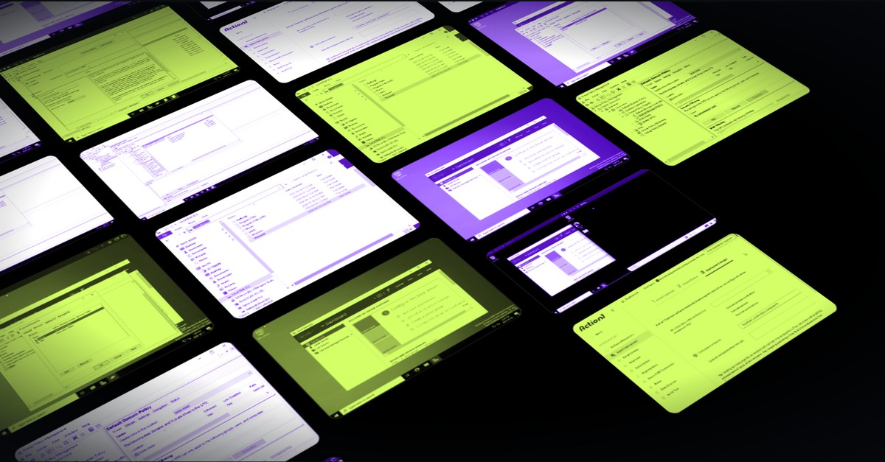

## Hi, I'm Simarjeet Singh

Computer Science graduate focused on IT support, systems administration, and continued learning in cybersecurity. I build home labs to practise real support work and document each one step by step.

**Portfolio:** [the-simarjeet.github.io](https://the-simarjeet.github.io) · **LinkedIn:** [simarjeet-singh](https://www.linkedin.com/in/simarjeet-singh-58670a256/)

### Featured lab

**[Windows IT Help Desk & Active Directory Home Lab](https://github.com/The-Simarjeet/windows-it-helpdesk-homelab)**: a small-business Windows domain built in UTM on macOS, covering Active Directory, security groups, NTFS and share permissions, Group Policy, mapped drives, and Action1 endpoint management.

### Currently working toward

- Google IT Support Professional Certificate
- CompTIA Security+
- CompTIA CySA+
